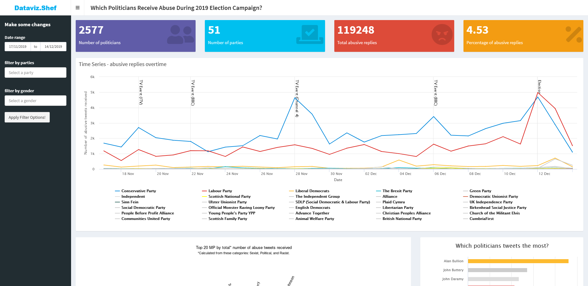

[![CC BY 4.0][cc-by-shield]][cc-by]

# Which-Politicians-Receive-Abuse
This repository contain source code and processed data for the shiny app - [Which Politicians Receive Abuse During 2019 Election Campaign?](https://ylwshef.shinyapps.io/Which-Politicians-Receive-Abuse/). The shiny app is built based on dataset made available by Gorrell, G., Bakir, M., Roberts, I., Greenwood, M., et al. (2020) on [Online Research Data](https://orda.shef.ac.uk) (the University of Sheffield's data repository). You might also be interested in the open access [article](https://doi.org/10.1140/epjds/s13688-020-00236-9)[1] they have published alongside the dataset.

## Licenses

Data[[2](https://doi.org/10.15131/shef.data.12340994.v1)] used in this repository is licensed under a
[Creative Commons Attribution 4.0 International License][cc-by]. 

[![CC BY 4.0][cc-by-image]][cc-by]

All other content (excluding logos or where explicitly stated) are licensed under the [MIT license](LICENSE).

[cc-by]: http://creativecommons.org/licenses/by/4.0/
[cc-by-image]: https://i.creativecommons.org/l/by/4.0/88x31.png
[cc-by-shield]: https://img.shields.io/badge/License-CC%20BY%204.0-lightgrey.svg

## Reference
1. Gorrell, G., Bakir, M.E., Roberts, I. et al. Which politicians receive abuse? Four factors illuminated in the UK general election 2019. EPJ Data Sci. 9, 18 (2020). https://doi.org/10.1140/epjds/s13688-020-00236-9
2. Gorrell, G., Bakir, M., Roberts, I., Greenwood, M., et al. (2020) Which Politicians Receive Abuse?. [Online]. Available from: https://doi.org/10.15131/shef.data.12340994.v1 [Accessed: 22 June 2021]. 

